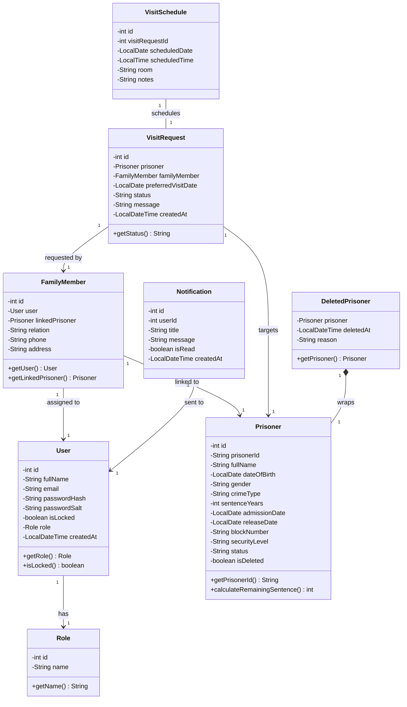

# Class Diagram - Prison Management System

This diagram represents the core Model classes and their relationships within the `com.anjal.model` package.

```mermaid
classDiagram
    class User {
        -int id
        -String fullName
        -String email
        -String passwordHash
        -String passwordSalt
        -boolean isLocked
        -Role role
        -LocalDateTime createdAt
        +getRole() Role
        +isLocked() boolean
    }

    class Role {
        -int id
        -String name
        +getName() String
    }

    class Prisoner {
        -int id
        -String prisonerId
        -String fullName
        -LocalDate dateOfBirth
        -String gender
        -String crimeType
        -int sentenceYears
        -LocalDate admissionDate
        -LocalDate releaseDate
        -String blockNumber
        -String securityLevel
        -String status
        -boolean isDeleted
        +getPrisonerId() String
        +calculateRemainingSentence() int
    }

    class FamilyMember {
        -int id
        -User user
        -Prisoner linkedPrisoner
        -String relation
        -String phone
        -String address
        +getUser() User
        +getLinkedPrisoner() Prisoner
    }

    class VisitRequest {
        -int id
        -Prisoner prisoner
        -FamilyMember familyMember
        -LocalDate preferredVisitDate
        -String status
        -String message
        -LocalDateTime createdAt
        +getStatus() String
    }

    class VisitSchedule {
        -int id
        -int visitRequestId
        -LocalDate scheduledDate
        -LocalTime scheduledTime
        -String room
        -String notes
    }

    class Notification {
        -int id
        -int userId
        -String title
        -String message
        -boolean isRead
        -LocalDateTime createdAt
    }

    class DeletedPrisoner {
        -Prisoner prisoner
        -LocalDateTime deletedAt
        -String reason
        +getPrisoner() Prisoner
    }

    %% Relationships
    User "1" --> "1" Role : has
    FamilyMember "1" --> "1" User : assigned to
    FamilyMember "1" --> "1" Prisoner : linked to
    VisitRequest "1" --> "1" Prisoner : targets
    VisitRequest "1" --> "1" FamilyMember : requested by
    VisitSchedule "1" -- "1" VisitRequest : schedules
    Notification "1" --> "1" User : sent to
    DeletedPrisoner "1" *-- "1" Prisoner : wraps
```
