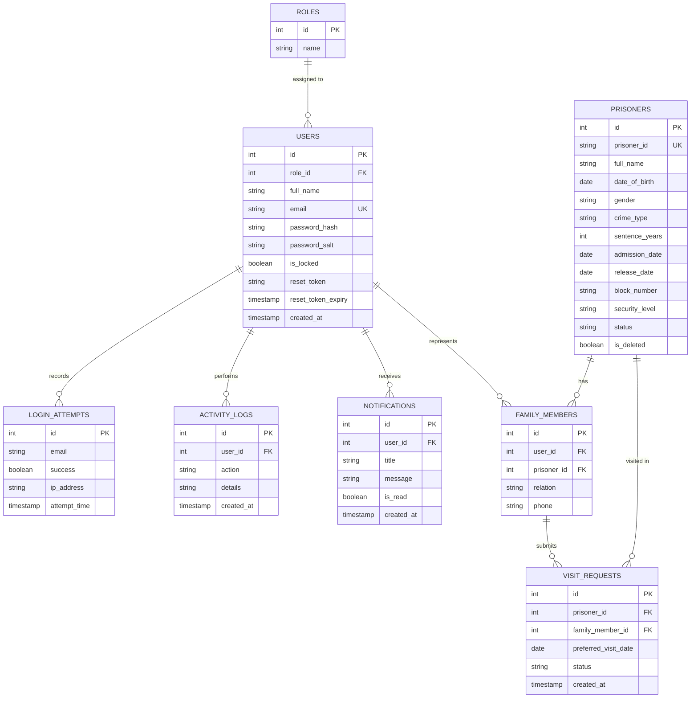

# Database Entity Relationship Diagram (ERD) - Prison Management System

This diagram illustrates the relational structure of the `prison_management_db`.

```mermaid
erDiagram
    ROLES ||--o{ USERS : "assigned to"
    USERS ||--o{ LOGIN_ATTEMPTS : "records"
    USERS ||--o{ ACTIVITY_LOGS : "performs"
    USERS ||--o{ NOTIFICATIONS : "receives"
    USERS ||--o{ FAMILY_MEMBERS : "represents"
    PRISONERS ||--o{ FAMILY_MEMBERS : "has"
    PRISONERS ||--o{ VISIT_REQUESTS : "visited in"
    FAMILY_MEMBERS ||--o{ VISIT_REQUESTS : "submits"

    ROLES {
        int id PK
        string name
    }

    USERS {
        int id PK
        int role_id FK
        string full_name
        string email UK
        string password_hash
        string password_salt
        boolean is_locked
        string reset_token
        timestamp reset_token_expiry
        timestamp created_at
    }

    PRISONERS {
        int id PK
        string prisoner_id UK
        string full_name
        date date_of_birth
        string gender
        string crime_type
        int sentence_years
        date admission_date
        date release_date
        string block_number
        string security_level
        string status
        boolean is_deleted
    }

    FAMILY_MEMBERS {
        int id PK
        int user_id FK
        int prisoner_id FK
        string relation
        string phone
    }

    VISIT_REQUESTS {
        int id PK
        int prisoner_id FK
        int family_member_id FK
        date preferred_visit_date
        string status
        timestamp created_at
    }

    ACTIVITY_LOGS {
        int id PK
        int user_id FK
        string action
        string details
        timestamp created_at
    }

    LOGIN_ATTEMPTS {
        int id PK
        string email
        boolean success
        string ip_address
        timestamp attempt_time
    }

    NOTIFICATIONS {
        int id PK
        int user_id FK
        string title
        string message
        boolean is_read
        timestamp created_at
    }
```
